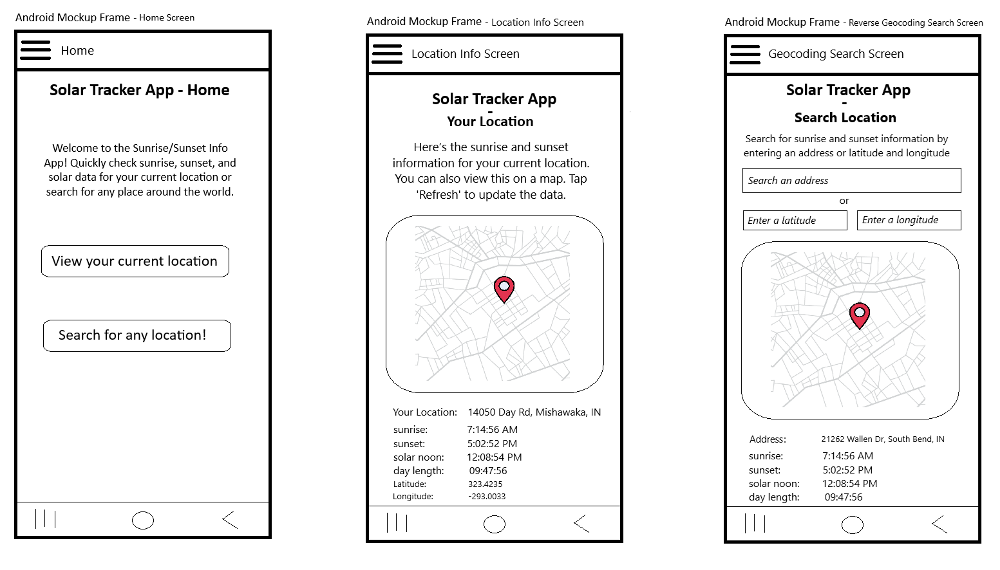

# SDEV257 - Final Project

**Overview:**

This app allows users to view sunrise, sunset, solar noon, and day length information for their current location or any searched location.\
It utilizes two REST APIs:

- [Sunrise-Sunset API](https://sunrise-sunset.org/api): Provides sunrise and sunset information based on latitude and longitude.

- [Nominatim OpenStreetMap API (OSM)](https://nominatim.openstreetmap.org/): Enables geocoding (convert addresses to coordinates and vice versa).

## Initial Project Requirements

Bellow is an outline of the initial instructions and requirements I was provided with before creating this project:

**1) Core Features:**

    Research and select a REST API to use in your app. Examples include APIs for weather, sports, movies, recipes, or city data.
    Retrieve and display relevant data based on the chosen API.
    Include at least one interactive feature, such as searching, filtering, or saving data.

**2) App Structure:**

    Implement at least three screens:
    Home Screen: Introduce the app and provide navigation to other features.
    Data Display Screen: Fetch and display information from the chosen API.
    Interactive Screen: Provide functionality such as filtering, favoriting, or other interactions.

**3) Technical Requirements:**

    Use Flexbox for responsive and adaptable layouts.
    Employ React Navigation for multi-screen functionality.
    Adhere to modular and reusable component design.

**4) Development Guidelines:**

    Host the source code on GitHub with a descriptive README file, including setup and usage instructions.
    Use meaningful and organized commit messages.
    Follow best practices for styling and code organization.

**5) Final Project Submission Requirements:**

    Work individually or in pairs.
    Submit the GitHub repository link by the deadline.

## Initial Planning Breakdown

Next is a full pre-development breakdown of app layouts and flow, and how requirements were to be fulfilled:

**1) Features**

- <u>View Sunrise/Sunset Information</u>:\
  Automatically fetch and display data for the user's current location.\
  Enter latitude and longitude to fetch sunrise/sunset information.

- <u>Search for Locations</u>:\
  Input an address to fetch an OSM API object containing coordinates.\
  Display sunrise/sunset information for the searched location.

- <u>Reverse Geocoding</u>:\
  Input latitude and longitude to find the corresponding address using OSM API.

**2) App Screens**

- <u>Home Screen</u>:\
  Brief introduction to the app.
  Buttons to navigate to "Location Info" and "Search" screens.
  Hamburger menu for navigation in top left.

- <u>Location Info Screen</u>:\
  Automatically display sunrise/sunset information for the user’s current location.\
  Displays users current location on a google maps embed\
  Button to refresh data for the current location.

- <u>Reverse Geocoding Search Screen</u>:\
  Search by address to get coordinates and display sunrise/sunset info.\
  Input fields for latitude and longitude to fetch address and sunrise/sunset info.\
  Results displayed below search fields.

 
Mockup:

Context Note:\
This project serves as the final assessment of skills and understanding I developed regarding\
React Native in the SDEV257 class with Kristopher Roberts at IvyTech Community College.
